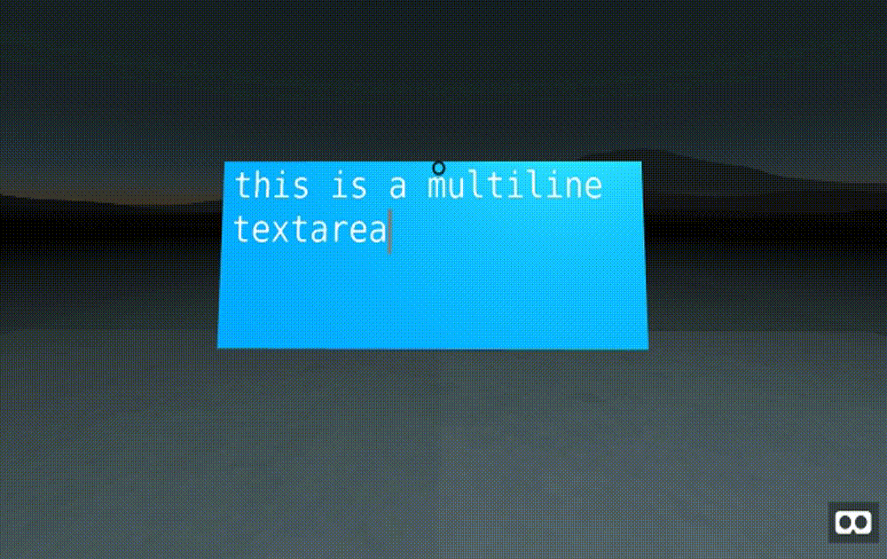

## aframe-textarea-component

[](https://npmjs.org/package/aframe-textarea-component)
[](https://npmjs.org/package/aframe-textarea-component)

A Textarea component for [A-Frame](https://aframe.io).

### Examples

- [Basic Example](https://brianpeiris.github.io/aframe-textarea-component/examples/basic/)



### Known issues

- Does not support text word-wrap.
- Only supports monospace fonts.

### API

| Property                  | Description                                       | Default Value |
| --------                  | -----------                                       | ------------- |
| cols                      | number of columns in the textarea                 | 40            |
| rows                      | number of rows in the textarea                    | 20            |
| color                     | color of the text                                 | black         |
| disabled                  | whether the control can receive keyboard inputs   | false         |
| selectionColor            | color of selected text                            | grey          |
| backgroundColor           | color of the background                           | white         |
| disabledBackgroundColor   | color of the background when disabled             | lightgrey     |
| text                      | default text in the textarea                      | ''            |

| Method                    | Description                                       |
| --------                  | -----------                                       |
| getText()                 | Get the current text in the textarea              |
| focus()                   | Focus the textarea                                |
| blur()                    | Blur the textarea                                 |

### Installation

#### Browser

Install and use by directly including the [browser files](dist):

```html
<head>
  <title>My A-Frame Scene</title>
  <script src="https://aframe.io/releases/1.3.0/aframe.min.js"></script>
  <script src="https://unpkg.com/aframe-textarea-component/dist/aframe-textarea-component.min.js"></script>
</head>

<body>
  <a-scene background="color: lightblue">
    <a-entity position="0 1.5 -1" textarea></a-entity>
    <a-camera><a-cursor></a-cursor></a-camera>
  </a-scene>
</body>
```

#### npm

Install via npm:

```bash
npm install aframe-textarea-component
```

Then require and use.

```js
require('aframe');
require('aframe-textarea-component');
```
